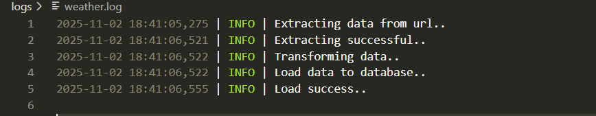

## 🌦️ **Weather ETL Pipeline — Python • PostgreSQL • Cron • YAML Config**

**Project:** End-to-end ETL pipeline

**Dataset:** Realtime weather API (Open-Meteo)

**Location:** Bandung, Indonesia

**Goal:** Build foundational ETL skills & automation without Airflow

---

### 🧠 **Overview**

Proyek ini mendemonstrasikan proses ETL (Extract-Transform-Load) menggunakan Python murni sebagai fondasi awal menuju sistem data engineering yang real.

Pipeline secara otomatis:

1. **Extract** data cuaca real-time dari API Open-Meteo
2. **Transform** data (pembersihan, konversi tipe, mapping kode cuaca → deskripsi cuaca)
3. **Load** data ke PostgreSQL lokal
4. **Log** setiap proses untuk audit dan debugging
5. **Run otomatis** menggunakan Cron scheduler

Proyek ini dibuat untuk memahami dasar-dasar data ingestion, pipeline automation, observability, dan configuration-driven pipeline architecture.

---

### 🚀 **Key Features**

| Fitur             | Deskripsi                                                    |
| ----------------- | ------------------------------------------------------------ |
| ✅ API ingestion   | Mengambil data cuaca real-time berdasarkan koordinat Bandung |
| ✅ Central config  | Pipeline dikontrol melalui file YAML, bukan hard-code        |
| ✅ Logging         | Setiap proses terekam ke file `.log`                         |
| ✅ Error handling  | Menangani error pull API & database load                     |
| ✅ PostgreSQL sink | Hasil dipersist ke tabel `weather`                           |
| ✅ Cron automation | Pipeline berjalan otomatis sesuai jadwal                     |
| ✅ Modular ETL     | Extract / Transform / Load terpisah (clean architecture)     |

---

### 🏗️ **Architecture Diagram**

### 🗂️ **Data Target Schema**

Tabel PostgreSQL: `weather`

| Kolom                | Deskripsi                                                     |
| -------------------- | ------------------------------------------------------------- |
| id                   | primary key                                                   |
| city                 | nama kota (Bandung)                                           |
| time                 | timestamp data cuaca                                          |
| temperature_2m       | suhu (°C)                                                     |
| precipitation        | curah hujan                                                   |
| wind_speed_10m       | kecepatan angin                                               |
| relative_humidity_2m | kelembapan udara                                              |
| apparent_temperature | suhu terasa                                                   |
| weather              | deskripsi kondisi cuaca (ex: “Cerah”, “Hujan”, “Badai Petir”) |

Table aligned with Open-Meteo data fields + custom weather mapping logic.

---

### ⚙️ **Configuration-Driven Pipeline**

Proyek menggunakan file `config.yaml` untuk menyimpan:

* Endpoint API
* Koordinat geografi Bandung
* Parameter fields to extract
* Target database URL
* Nama tabel target

Pendekatan ini memastikan pipeline **mudah diubah** tanpa mengutak-atik kode.

---

### 🔐 **Environment & Tools**

| Komponen   | Teknologi               |
| ---------- | ----------------------- |
| Language   | Python                  |
| Database   | PostgreSQL              |
| Config     | YAML                    |
| Scheduler  | Linux Cron              |
| ORM/Engine | SQLAlchemy + Pandas     |
| Logging    | Python built-in logging |

---

### 🕑 **Automation (Cron)**

Pipeline dijalankan otomatis di Linux menggunakan cron, memungkinkan pengambilan data berkala untuk analisis historis dan time-series.

---

### **Screenshoot logs:**

---

### 📈 **Outcome**

* Pipeline ETL modular & dapat dikonfigurasi
* Data cuaca real-time tersimpan rapi dalam database
* Mampu dijalankan otomatis & dapat di-monitor via log
* Pondasi kuat menuju Airflow-based orchestration

---

### 🎯 **Future Enhancements**

| Enhancement               | Manfaat                       |
| ------------------------- | ----------------------------- |
| Dockerization             | portability & deployment      |
| Alerting (Slack/Email)    | monitoring real-time failures |
| Retry mechanism           | handle API downtime           |
| Airflow DAG version       | enterprise orchestration      |
| Data warehouse (BigQuery) | scalable storage              |
| Grafana dashboard         | live visualization            |

---

### 🙋‍♂️ **About**

Project oleh **Sanju**

---